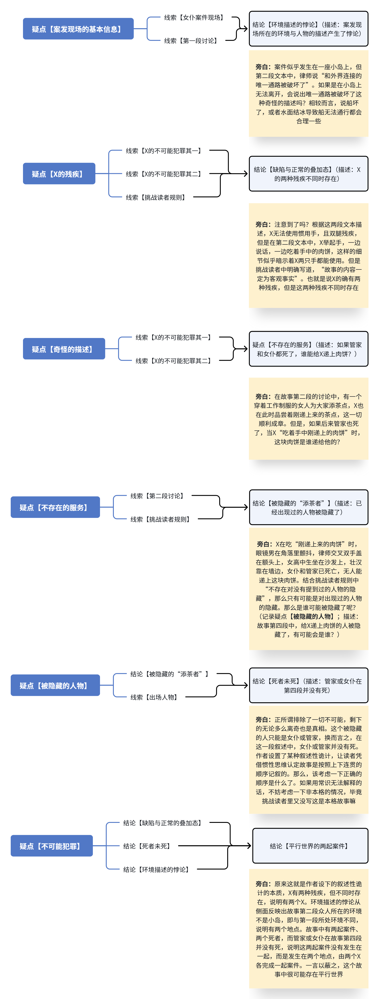

#  游戏 demo 流程

> 自游戏开始的那一刻起，旁白即是时今的意识整体（未注明的非括号内段落均为旁白）
## 0. 悬念：神秘意象的闪回

### 0.1 为入梦的人类命名

旁白：你醒了？你已经是个女孩子了——开个玩笑，你还有自己选择的权利。
（玩家选择主角性别。备注：性别对剧情不产生影响，但可能影响某些交互逻辑）
旁白：你还记得你是谁吗？
（玩家设置主角名称）
旁白：很好，看来一切正常。接下来，来听故事吧。

## 0.2 谜语人环节（BGM：《调律》）

旁白：
（黑屏）今天的故事，讲的是一只灯塔水母。

千姿百态的海洋居民，居住在深海的王国之中，他们自由自在地在水中游弋，未曾望过海平面上的天空。
小小的灯塔水母，天生有着向往未知的好奇与冲动，她辞别栖居的故土，刻录下启程的初衷。
海底的沙床，是她暂歇的居所；记忆的牵引，是她笃行的依托。

（切到序章场景，主角醒来）
主角：“咳咳咳，咳咳……”
[图片]
图1：玩家在一个石头旁的火堆处醒来，进行操作教学，暴风雪刮过，火堆熄灭，玩家靠近火堆高亮提示进行交互，交互后火堆复燃但再次熄灭（获得任务：寻找温暖）往右走进入下一个地图

（进入下一场景）
（黑屏）灯塔水母游入阴影，灯笼鱼前来点亮光明。“你要去往哪里？”“去追寻那上方的无垠。”
灯笼鱼摇摇灯笼，“这是无尽头的旅行，即使燃尽我的生命，目标仍是遥遥无期。”
灯塔水母告别掌灯的伙伴，只身向着彼方独行。章鱼拦住她的去路，“卑微如你岂配如此野心？”
灯塔水母不卑不亢，“这是我的决心，这是我的使命，从未轮到由你来定义。”
灯塔水母诀别不善的讥讽，决然向着彼方前行。一只水母好奇地绕着她转圈，“你要去往哪里？”
“去追寻那上方的无垠。”她的信念不移。“可允许我与你同行？”她招招手以示欢迎。

（恢复正常场景）
主角：“咳咳，咳咳咳……暴风雪越来越大了，得赶快找到一个……咳……”
[图片]
图2：玩家继续朝着光亮地方走去，每移动一段距离刮过暴风雪

（进入下一场景）
（黑屏）海洋瞬息万变，转眼暗流侵袭。熔岩的热浪翻涌，沙床的震动不停。
水母不敌灾变的降临，于石缝间结束了生命。灯塔水母不甘终焉，于沙床下闭上眼睛。
灾变已去，波平浪静。灯塔水母重获新生，惊讶于还童的身体。
水母伙伴溘然长逝，她擦去眼中的泪滴。“去追寻那上方的无垠”，记忆深处回响着她的初心。

（恢复正常场景）
主角：“前面的光……咳咳……是……咳咳……太好了，有救了……咳咳咳……”

（主角走到别墅门口）
（黑屏）再度起行，哪怕终点遥不可及，周而复始的生命，汇成聚沙成塔的权柄。
依然会有灯笼鱼为她点亮光明，“我见过你吗？”“我想没有。”她继续着她的独行。
依然会有章鱼嘲弄她的决定，“我见过你吗？”“怎么可能？”她继续着她的笃行。
依然会有水母与她同行，“我见过你吗？”“应该没有吧。”她们彼此相伴而行。
（恢复正常场景）

（玩家按下交互键，敲门，播放敲门声；还不要切换场景）
主角：“咳……有人吗……咳咳……拜托了……”
……但是没有人来。
你又敲了敲门。直到这时，大门才被打开
（此时切换场景，进入别墅大厅场景，此时经过正好经过大厅的梅塔发现了主角，出现梅塔立绘）
梅塔：“……”
梅塔：“……管家，把这位客人送到书房休息。”

就在你看到他的一瞬间，一阵不属于你的回忆涌入了你的脑海：
（黑屏）滂沱的大雨冲刷着泥沼般的地面，你的下半身陷入其中无法动弹。
爆燃声此起彼伏，剧烈的冲击与热浪蚕食着你的躯体，强烈的痛苦与恐惧啃噬着你的精神。
当硝烟稍稍散去，你望着远处的那个人影，强装镇定。
“玩够了吗？到我了吧。”
下一瞬，那个人影身下的地面突然钻出一根尖刺，直直将其穿透……
回忆结束，你的身体也到了极限，沉沉地倒了下去……

（黑屏）生命总在此后戛然而止，新生亦在彼时重启如初。她已习惯了别离与讥讽，习惯了死亡与重生。
她已不再是她，她亦一直是她。她一直在被改变，她亦从未改变。
“这无止境的旅途，何时才能结束？”“这无止境的旅途，终将迎来尽头。”
无人知晓其开端，无人预见其终结。从海平面上投来的光芒越来越亮，昭示着终点近在眼前……

好了，故事到这里就讲完了。晚安，祝你做个好梦。
（切bgm，异数logo显现）

## 1. 幕启：初入雪墅的圜局

### 1.1 入局（BGM：《冬之旋律》）

（切换场景到书房，书房内只有管家和主角）
管家：“你醒了，客人。”
主角：“你……这里是……我刚刚……”
管家：“客人，还请您放轻松，您刚刚敲响别墅的大门，我打开大门时你直接倒在门口了，便奉主人的命令好好照顾你。”
主角：“主人？是那个红头发的男人吗？”
倒下前的那段记忆又再次浮现在脑海里……
管家：“是的，如你所见我是一名人工智能管家，梅塔是我的主人，也是这栋别墅的主人。”
管家：“请问客人你的名字是？”
主角：“我是{PlayerName}”
管家：“那请问……您来到这里有何贵干？”
“有何贵干”，你在心中重复了一遍这个问题
这时候你才发现，除了你的名字，你什么都想不起来
主角：“……我……我……”
你不知该说什么，只是在一双审视的眼神中支支吾吾了半天
管家：“……如果不愿意说也没有关系，哪怕只是在这借住一晚躲避外面的暴风雪也是可以的”
管家：“你的身体在暴风雪中冻了太久，尚未完全恢复。”
管家：“很抱歉，寒舍的客房已经被其他进来避雪的客人住满了，只能请你在书房好好休息，不要在外面走动。”
管家：“我过段时间再来看望你。”
说完管家关上书房的门离开了
主角：“……”
闲着也是闲着，不如四处看看？
（玩家可以自由操作主角在书房里走动，可调查书房线索；书房线索使用D:\Games\Abismo\assets\objects\clues\ch1_snow_villa中已有的书房线索，但不要用原文件，而是复制到D:\Games\Abismo\assets\objects\clues\demo\下；线索摆放可使用现有的线索摆放方案，也要创建对应的demo文件夹并放入）

（线索调查完毕后）
看起来是很普通的一间书房，还有一些引人深思的名人名言。会有用吗？总之先记下来吧
咦，这里还有一本推理题合集，不妨用它来打发一下时间？
（高亮提示调查椅子，主角在椅子上坐下，开始谜题环节。谜题篇幅较长，可用全屏对话框展示。其中谜题和挑战读者部分分两次展示）

【谜题】
女仆死了。在2006年12月20日。一个风雪交加的夜里。
这时海浪依然拍打着离岸的小岛。海里藏着幽暗的故事。
她的尸体仰躺在地上，血迹浸染了红木地板上的花纹，脑袋被巨大的斧头近乎劈开。斧头上映出的金属光泽昭示着这无疑是前厅的那把巨斧。
甲胄手中的武器。
重五十斤的杀人利器。
…………
“所以……我们现在要怎么办？”女高中生低着头说道。
“和外界连接的唯一通路被破坏了，电话线也被切断了，我们现在根本没法联系上外界。”律师用手撑在桌上，眉头紧锁。
“到底是谁做的！赶紧站出来，否则我就一个一个的逼你出来。”壮汉捏紧了手中的拳头，朗声说道。
“冒昧打扰，不过像客人们这样下去，恐怕什么问题也解决不了。”穿着工作制服的女人正弯腰添着水，话语却有些不容置疑。
“不如这样，容在下来确认各位这段时间的行踪，讨论下各位的作案可能吧。”
“我没问题……”一直待在角落的眼镜男也举起了手，怯生生地搭上了话。
“啧，没别的办法了吗。”壮汉拧过头，看起来对这个决定相当不满。
这样的时刻，X却一点也不见担心，品尝着刚添上的茶点，“不过不管怎么样，我都没有嫌疑吧？”
点心掉到了地上，X“不好意思”地说着，有些费力地用左手够着掉落的东西，“毕竟，我的身体有问题嘛。”
“是啊，目前来看X的嫌疑很低。毕竟惯用手无法使用对行动的影响很大，这是毋庸置疑的。”女人鞠躬断言道。
…………
2006年12月20日，不知道这是否是一个特殊的日子，至少过去不是。但，今后或许会变成一个特殊的日子。某人的祭日。
管家死了。
那个总是领导着我们的女人，死了。
踏上生活区去顶楼的楼梯。每走一步，好像便往深渊坠落了一分。
五层楼的距离，不算短，但也不长。如今却仿佛凌迟一般折磨。
终于到了。推开门……先是铺面的飞雪，然后是，血的腥气。
她的尸体被遗弃在天台的暴雪里，胸口插着一把匕首，血迹染上灰白色。隐没的日光也无法拯救她。
…………
“所以……现在我们要怎么做？”眼镜男在角落里浑身颤抖着。
“还能怎么办。暴风雪下的太大了，我们必须在这等上几天。”律师习惯性地交叉起双手，盖在自己的额头上。
“而且电话线也……”女高中生坐在沙发上小声念叨着。
“这鬼地方到底怎么回事，又是暴风雪又是死人的，真晦气。”壮汉靠在墙边往地上啐了一口。
“那个，我应该不能作案吧。”X举起了手，所有人都看了过来。
“毕竟我的身体出了点问题嘛。”尽管如此，X依然无动于衷地吃着手中刚递上的肉饼。
“是啊，X如果作案的话，确实会比一般人困难呢。毕竟双腿残疾，根本无法独自进行复杂的行动。”律师放下交叉的手，微微点头。
“当然如此……毕竟，我不是凶手。”X露出了完美的微笑。

【挑战读者】
挑战读者：
1.故事中所有出场人物均已交代完毕，故事中不存在对没有提到过的人物的隐藏。
2.故事中不存在省力或可远程操控的机关，凶手的杀人行为均为亲力亲为。
3.故事中记录的内容一定为客观事实，不存在假死或虚构。
4.故事中有且仅有一个真凶，没有帮凶，而且可以直接告诉诸位读者，就是X。
现在，请各位告诉我，X是如何完成以上两起案件的？

【推理过程】
看起来故事中发生了两起案件，女仆之死与管家之死。
杀死女仆的凶器是重达五十斤的巨斧，但X无法使用惯用手，所以排除了他的嫌疑。
杀死管家则需要爬上五楼的天台，但X双腿残疾，所以又排除了他的嫌疑。
在这种情况下，X要怎么成为凶手呢？（记录疑点【不可能犯罪】；描述：X应该如何在无法使用惯用手的情况下杀死女仆，又该如何在双腿残疾的情况下爬上五楼杀死管家？）
当然还有一种可能，X的残疾并不是表面上看起来的那样？（记录疑点【X的残疾】；描述：X无法使用惯用手，并且双腿残疾，有线索能推翻吗？）
还有一些细节上的违和感，恐怕这不是作者的疏漏，而是有意为之。先试着梳理一下案件发生的环境，以及众人对话中的违和之处吧（记录疑点【案发现场的基本信息】；描述：案发现场处在一个什么样的大背景下，众人的对话中好像有一些和这样的背景违和的地方？）
此外，既然X已经确定是凶手了，再仔细观察一下有关他行为的描述吧，好像也有一些奇怪的地方……（记录疑点【奇怪的描述】；描述：对X某些行为的描述细节上有一些奇怪的地方，相似的文段随着情节的变化可能会有不同的含义）
最后再将故事的文本整理成线索……（以下线索由旁白展示，同时记录至线索栏）
【女仆案件现场】（故事第1-5段）2006年12月20日，风雪交加，在一座离岸的小岛上发生了凶案，女仆被重五十斤的巨斧杀害。
【第一段讨论】（故事6-11段）讨论中出现了女高中生、律师、壮汉、穿着工作制服的女人、眼镜男。众人发现和外界连接的唯一通路被破坏了，电话线也被切断。
【X的不可能犯罪其一】（故事12-14段）X品尝着刚递上来的糕点，糕点不慎掉落，他有些费力地用左手去捡。穿着工作制服的女人证明X无法使用惯用手，认定他嫌疑很低。
【管家案件现场】（故事15-21段）2006年12月20日，风雪交加，在五楼的天台上发现了管家的尸体，胸口插着一把匕首。
【第二段讨论】（故事22-25段）讨论中出现了眼镜男、律师、女高中生、壮汉。众人发现暴风雪导致他们无法离开，电话线也被切断。
【X的不可能犯罪其二】（故事26-29段）X举起手发言，一边吃着刚递上的肉饼一边说自己的身体有问题。律师证明X双腿残疾，认定他作案会有困难。
【挑战读者规则】故事中不存在对没有提到的人物的隐藏；故事中不存在机关；故事记录的内容一定客观真实；故事有且仅有一个真凶即X。
【出场人物】管家、女仆、女高中生、律师、壮汉、眼镜男、X。

（下为疑点解决逻辑；当玩家成功推理得出结论或疑点后，在线索栏的交互模式下展示结论线索（如果得到的是线索）或在疑点栏中展示疑点（如果得到的是疑点），并触发图中相应结论或疑点下方的旁白）

（谜题解决后，即得出结论【平行世界的两起案件】：描述：作者利用了叙述性诡计，X有两种残疾，但不同时存在，案件是在两个平行世界各自发生的。X完全可以在无法使用惯用手的情况下爬上五楼天台，用匕首杀死管家；也完全可以在双腿残疾的情况下，用巨斧杀死女仆。作者调换了两起案件案发后众人的讨论，制造出X不可能犯罪的假象。）

（当玩家解决最后一个疑点后，会获得结论【平行世界的两起案件】，打开线索栏的交互模式并播放相应的旁白；检测当前打开的线索栏，若玩家关闭，则自动播放下面的timeline）
平行世界的诡计被揭露出来以后，故事的真相就呼之欲出了
X完全可以在无法使用惯用手的情况下爬上五楼天台，用匕首杀死管家
也完全可以在双腿残疾的情况下，用巨斧杀死女仆
作者调换了两起案件案发后众人的讨论，制造出X不可能犯罪的假象
如此一来，故事中还有些古怪的细节也说得通了
比如两段讨论中明显有雷同的部分，完全没有必要说两遍，但如果是发生在两个平行世界的讨论就不奇怪了
还比如在故事的第三段中，“某人的祭日”这个词，想必不能用在同时有两人死亡的情况下吧
再比如其他人说出X的身体缺陷时，说的都是“对行动的影响很大”“比一般人困难”，而不是“不可能做到”
如果真是无法使用惯用手而要举起五十斤重的凶器，或是双腿残疾却要爬上五楼行凶，是可谓“不可能做到”了
正当你回味着推理的过程时，一阵急促的敲门声将你拉回了现实
你向门口看去，管家将书房门打开，急忙走了进来
管家：“有一件不幸的事情需要告知你，就在刚刚，我的主人梅塔被人杀害，凶手就和我们在同一个屋檐下。”
主角：“……！？”
管家：“直到案发之前，我一直守在书房门口，因此你是唯一没有作案嫌疑的人。”
管家：“我知道这可能一时半会有点难以接受，但我希望你能接受我的请求——我希望你能参与我们的调查。”
暴风雪山庄吗......真是老套的设定。明明只想借住一晚度过这该死的暴风雪，没想到竟然摊上这等事。但……你能够解决的吧？就当是一个支线任务？
主角：【抉择1】

管家：“感谢。事不宜迟，我先带你去看案发现场。”

### 1.2 案发现场（BGM：《暗雾谎言》）

（场景切换，管家带主角进苏溟玖房间，此时其余人聚集在房间内）
管家带你来到了案发现场——这似乎是一间客房。据管家说，此时的房间内聚集了别墅里的所有人。
空气中弥漫着一股血腥味，压抑得让人喘不过气。
你看向了在场的另外五个人——或者说，五名嫌疑人。
但就和初次见到别墅主人一样，一段段不属于你的记忆窜入了你的脑海……
在右边，你看见一名眉头紧锁、心事重重的中年男人（显示松林夕立绘）
（黑屏）……
晚饭后，你一个人在后花园散心。夕阳将落未落，染红了天边的云霞，如同熊熊的烈火燃烧着无边的寂寥。宁静的花园小径旁，几棵松树半包围着一间凉亭，一个约莫八岁的小女孩独自一人趴在凉亭内的石桌上，用笔在纸上写着什么
（回到房间）……
你看见一名气质不凡、面色沉重的年轻男子（显示穆暌信立绘）
（黑屏）……
那天夜里电闪雷鸣，你心中的不安也随着天气的恶化而放大，以致于独自身躺在床上辗转难眠。不知何时，你依稀闻到了一股烟味，走出房间竟发现走廊上方已聚满浓烟
（回到房间）……
往左边看，你看见一名面色惨白的年轻女子，正紧紧牵着另一名少女的手（显示苏溟玖立绘）
（黑屏）……
五处地点都如约燃起了火光，随后，五色光束依次升上天空，穹顶之上，赫然出现了一个巨大的纹样。你双手紧紧相握，望着这绝美而壮阔的图景。无声无息中，天空绽放出光亮。漆黑的天幕迅速褪去，露出了万里无云的晴空
（回到房间）……
那名少女稚气未脱，身体不安地微微发抖（显示乌停湘立绘）
（黑屏）……
（此处暂时占位，具体内容还没想好）
（回到房间）……
最后，衣柜前那个不修边幅的男人回过头，打量着你（显示夏中清立绘）
（黑屏）……
你摸索着找到了电灯开关，随着“咔”一声，空间内的灯亮了起来。你发觉自己站在实验室的一角，而实验室的中央，是数个被浸泡在不明液体中，到处连接着电极的人类大脑！
（回到房间）……
你的头感到一阵眩晕，不由得往前踉跄几步，好在有人拉住了你，这才没有摔倒。
主角：“谢谢……”
视野恢复正常后，你发觉自己已经来到了衣柜前，拉住你的正是你最后看到的那个人
血腥味愈发刺鼻，不祥的预感涌上你的心头，驱使你往衣柜里看去——
（展示尸体cg）
（钟声音效，黑屏，demo到此结束）
