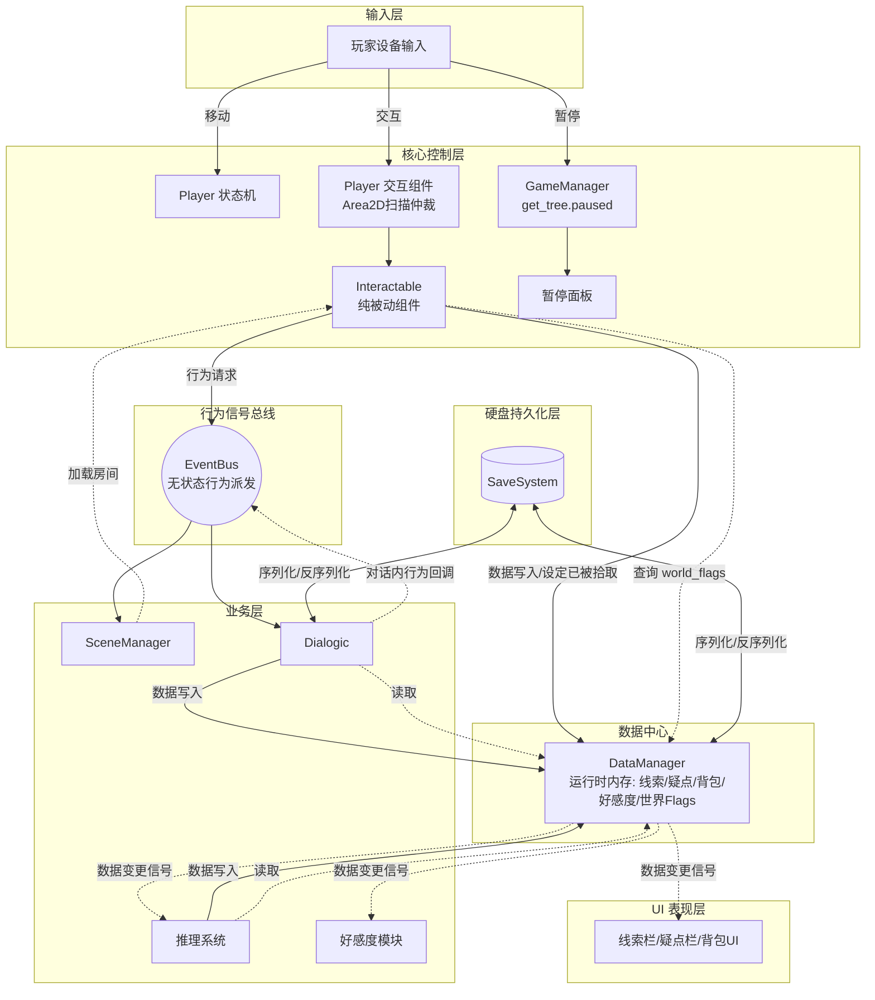

# 《异数 (Abismo)》AI 开发指南与技术架构参考 (TDD)

> **[To AI Agent]** 
> 你当前正在协助开发 2D 像素俯视角推理 AVG 游戏《异数》。
> 在执行任何代码编写任务前，请务必严格遵守本文档定义的架构规范与编码标准。不要自由发挥系统间的耦合方式。

## 一、 项目环境与全局规范

### 1. 技术栈

*   **引擎版本**: Godot 4.6.1 (注意规避 3.x API)
*   **语言**: GDScript 2.0

### 2. AI 编码绝对法则

1.  **强类型声明 (Strict Typing)**：所有的变量、函数返回值、参数必须显式声明类型。例如：`var speed: float = 200.0`，`func get_clue(id: String) -> ClueData:`。
2.  **事件总线模式 (Event Bus)**：禁止系统之间、UI与场景实体之间的硬引用（`get_node("../路径")`），但允许通过全局单例直接调用。对于非全局单例的跨模块通信必须通过 event_bus.gd 中的全局 Signal 转发。
3.  **职责分离 (Separation of Concerns)**：
    *   纯数据应该使用 `Resource` 定义（如配置项）或存入全局 `Dict`（如运行时玩家存档）。
    *   UI 节点 (`Control`) 仅负责展示界面的更新流，不可直接处理场景逻辑计算。
4.  **命名规范**：
    *   类名/节点名：`PascalCase` (如 `PlayerStateMachine`, `InteractableDoor`)
    *   变量/函数/文件/文件夹：`snake_case` (如 `player_state.gd`, `move_speed`)
    *   自定义类必须带 `class_name` 注册，以便于全局类型提示。

---

## 二、 核心架构设计

### 1. 全局单例 (Autoloads)

项目运行期必须挂载以下单例节点，AI 在按章开发时需对齐这些调用口：
*   `EventBus` (`event_bus.gd`): 存放所有全局信号。如 `signal clue_collected(clue_id: String)`。目前已有文件`scripts/event_bus.gd`，后续可根据需要添加更多信号。
*   `GameManager` (`game_manager.gd`): 负责管理游戏整体流程、暂停状态。目前无文件，需设计并实现。
*   `SceneManager` (`scene_manager.gd`): 处理关卡和房间的切换及过渡黑屏动画。目前仅有场景切换脚本`scripts/scenes/transition.gd`，后续应重构设计并实现更通用的场景管理器。
*   `DataManager` (`data_manager.gd`): 负责存储和管理游戏运行时数据，如玩家已收集的线索、已发现的疑点、好感度等。当前无文件，需设计并实现。

### 2. 交互系统 (Interactable System)
*   使用组件化思路。建立基础类 `class_name Interactable extends Area2D`。
*   具备通用属性：`@export var interact_id: String`, `@export var is_one_time: bool`。
*   所有的交互逻辑（门、线索实体、NPC对话热点）均继承或挂载该组件。

### 3. 系统模块流向图 (Architecture Diagram)

以下是本项目的核心数据与事件流向图，展示了输入、业务逻辑、数据持久化之间的边界与通信方式。**禁止在未讨论的情况下擅自打破图中的数据流向（如让 Interactable绕过DataManager直接发数据改动信号）。**

### 4. 接口与通信约定表 (Interface Convention)

配合上述架构图，各系统间的通信必须遵循以下 API 约定（具体函数名随迭代更新，但通信方式和流向固定）：

| 通信路径 | 方式 | 具体接口 / 信号预期 |
| :--- | :--- | :--- |
| **Interactable → DataManager** | 直接调用单例 | `add_clue(id)`, `add_item(id)`, `set_world_flag(id)` |
| **Interactable → EventBus** | 触发信号 | `scene_change_requested`, `dialogue_requested` |
| **DataManager → UI / 业务层** | 自身抛出信号 | `clue_updated`, `inventory_changed`, `affinity_changed` |
| **Dialogic → DataManager** | 直接调用单例 | `add_clue(id)`, `change_affinity(npc, value)` |
| **推理系统 → DataManager** | 直接调用单例 | `add_conclusion(id)` |
| **SaveSystem ↔ DataManager/Dialogic**| 序列化/反序列化 | `save_game()`, `load_game()` (**仅**在玩家主动存档/读档时触发) |

---

## 三、 MVP (最小可行性产品) 迭代开发计划

> **[To AI Agent]**
> 开发流程按照以下阶段 (Phase) 严格推进。一次对话仅专注一个 Phase 的一个小目标。未经 User 指示，不得跨阶段编写代码。

### 🧩 Phase 1: 核心基础 (Core Foundation)
**目标：搭建稳健的玩家实体、状态机与基础移动碰撞。**
1.  **Task 1.1**: 创建 `Player` 节点结构 (CharacterBody2D)，配置基础碰撞体 (CollisionShape2D) 和动画播放器 (AnimationPlayer/AnimatedSprite2D)。
2.  **Task 1.2**: 在 state_machine 下实现状态机基类 (`node_state_machine.gd`) 和状态节点基类 (`state.gd`)。
3.  **Task 1.3**: 编写并装配 `IdleState` 和 `WalkState`。实现经典的 4 向或 8 向 2D 俯视角移动逻辑（处理输入向量、标准化、摩擦力与加速度）。
4.  **Task 1.4**: 实现地形瓦片测试地图 (`test_map_rect.tscn`)，确保人物移动与墙体碰撞表现正常，摄像机 (`Camera2D`) 平滑跟随。

### 🖐️ Phase 2: 交互基类构建 (Interaction Base)
**目标：实现玩家与环境解耦的检测与交互机制。**
1.  **Task 2.1**: 为 `Player` 节点添加 `InteractionArea` (Area2D)，用于检测附近的物体。
2.  **Task 2.2**: 创建基础可交互组件类 `class_name Interactable extends Area2D`。包含虚函数 `func _on_interact(_player: Node2D) -> void:` 以及触发视觉提示的逻辑（如上方浮现按键图标）。
3.  **Task 2.3**: 建立玩家输入检测，靠近 `Interactable` 物体时高亮/提示，按下交互键 (F) 时调用该物体的 `_on_interact()`，并用 `print()` 进行调试输出。
4.  **Task 2.4**: 基于 `Interactable` 派生测试两种子类：`SceneTransitionDoor`（场景门测试）与 `ItemPickup`（物品拾取测试）。暂不衔接真实数据。

### 💾 Phase 3: 线索获取与数据持久化 (Clue Data & Storage)
**目标：在后台完成数据模型，不碰前端UI，确保数据流转正确。**
1.  **Task 3.1**: 定义线索数据结构：建立 `class_name ClueData extends Resource`。包含字段：`id`, `title`, `description`, `category` (发现位置分类), `time_found`。
2.  **Task 3.2**: 安装 `EventBus`，加入信号 `signal clue_collected(clue_id: String)`。
3.  **Task 3.3**: 初始化 `DataManager` 单例。监听 `clue_collected` 信号。当信号触发时，在 `DataManager` 的运行时数据字典中追加该 `clue_id`，模拟存档内存保存。
4.  **Task 3.4**: 将 Phase 2 中的 `ItemPickup` 改写为真正的 `ClueItem`。交互后触发：`EventBus.clue_collected.emit(my_clue_id)`，并在需要的情况下销毁自己或关闭下次交互高亮。

### 🖥️ Phase 4: 系统 UI 可视化 (UI Visualization)
**目标：将底层收集的线索数据展示在游戏界面中。**
1.  **Task 4.1**: 搭建系统主 UI 节点 (`CanvasLayer`) 和线索记录栏面板界面。通过输入事件（如键盘 `Tab` 或 `I`）切换面板的显示与隐藏。
2.  **Task 4.2**: 编写 `clue_ui.gd` 脚本。当面板打开时，从 `DataManager` 获取已解锁的线索列表数据 (`player_clues`)。
3.  **Task 4.3**: 动态生成 UI 条目 (Instantiate `Control` 预制体)，根据对应线索的 Resource 数据渲染标题和描述，并根据 `category` 进行折叠/分类排版。
4.  **Task 4.4**: 接入红点提示逻辑：`DataManager` 记录 `new_clues: Array`，主界面按钮绑定该状态显示红点；玩家点开该线索后将其从 `new_clues` 移除，红点消失。

---
> **[AI Agent 验证]** 每次开始输出代码前，明确你处于哪一个 Phase 的哪一个 Task，并且说明你即将修改或创建的文件路径，以供 User 审核。