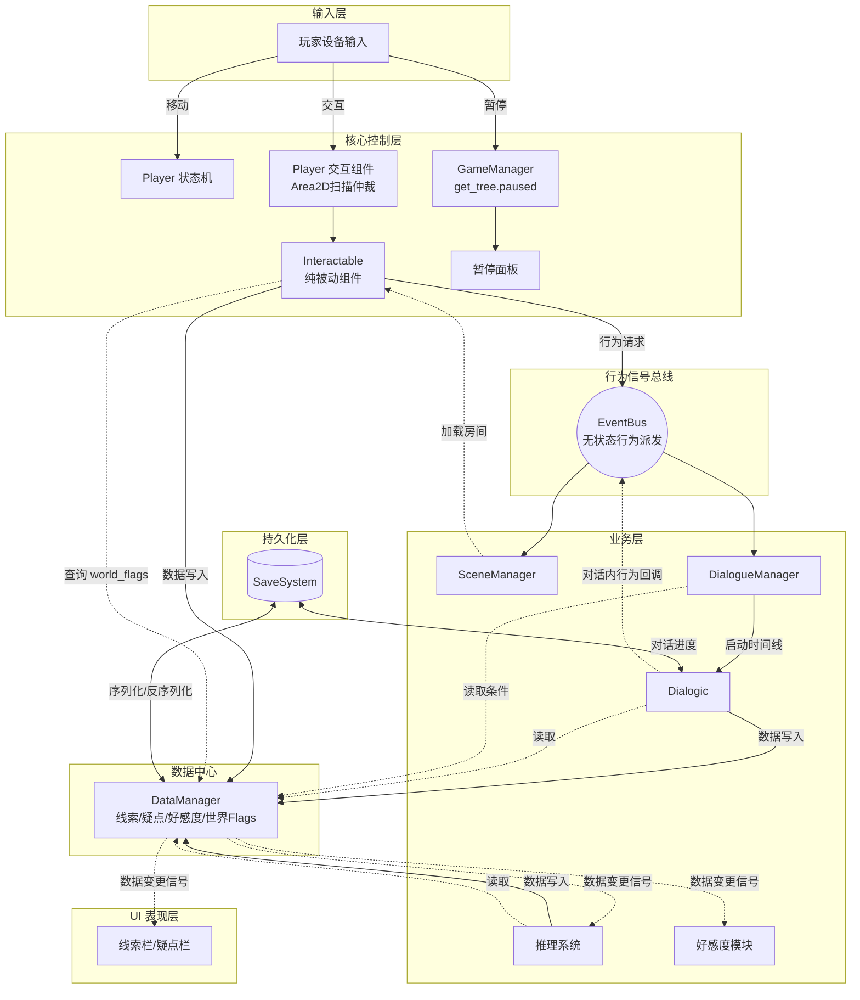

# 《异数 (Abismo)》AI 开发指南与技术架构文档

> **[To AI Agent]**
> 你当前正在协助开发 2D 像素俯视角推理 AVG 游戏《异数》。
> 在执行任何代码编写任务前，请务必严格遵守本文档定义的架构规范与编码标准。不要自由发挥系统间的耦合方式。

---

## 一、项目环境与全局规范

### 1. 技术栈

- **引擎版本**: Godot 4.6.1（注意规避 3.x API）
- **语言**: GDScript 2.0
- **目标平台**: Windows 10 及以上
- **分辨率**: 1920×1080
- **对话插件**: Dialogic 2（已安装，Autoload 已注册）

### 2. AI 编码规则

1. **强类型声明**：所有变量、函数参数、返回值必须显式声明类型。
   ```gdscript
   var speed: float = 200.0
   func get_clue(id: String) -> ClueData:
   ```
2. **禁止路径硬引用**：禁止使用 `get_node("../../路径")` 进行跨模块引用。跨模块通信只允许两种方式：
   - **直接调用全局单例**（一对一命令，如 `DataManager.add_clue(id)`）
   - **通过 EventBus 信号**（一对多行为派发，如 `EventBus.scene_change_requested.emit(...)`）
3. **单向数据流**：数据修改方只调用 DataManager 的方法；DataManager 在内部完成数据变更后，由自身发出信号通知 UI 和其他监听者。禁止 Interactable 等外部模块绕过 DataManager 直接发出数据变更信号。
4. **职责分离**：
   - 纯数据使用 `Resource` 定义（如 `ClueData`、`SuspicionData`），运行时状态存入 DataManager 的字典。
   - UI 节点（`Control`）仅负责展示和响应用户操作，不处理业务逻辑。
5. **命名规范**：
   - 类名 / 节点名：`PascalCase`（如 `PlayerStateMachine`、`InteractableDoor`）
   - 变量 / 函数 / 文件 / 文件夹：`snake_case`（如 `player_state.gd`、`move_speed`）
   - 自定义类必须带 `class_name` 注册。

### 3. 文件结构

```text
Abismo/
├── addons/                    # 第三方插件（Dialogic 2 等）
├── assets/                    # 美术与音频资源
│   ├── characters/            # 角色资源（含 npcs/*.dch 对话角色文件）
│   ├── dialogues/             # Dialogic 对话时间线 (*.dtl)
│   ├── game/                  # 通用基础资源
│   ├── interior/              # 室内场景美术
│   ├── objects/               # 物件与道具资源
│   └── UI/                    # 界面贴图与字体
├── scenes/                    # 场景文件 (.tscn)
│   ├── characters/            # 角色预制体
│   ├── objects/               # 物件预制体
│   ├── rooms/                 # 游戏房间场景
│   ├── test/                  # 测试用场景
│   └── UI/                    # UI 组件预制体
├── scripts/                   # 脚本 (.gd)
│   ├── characters/            # 角色控制与状态机
│   ├── objects/               # 物件与交互逻辑
│   ├── scenes/                # 场景管理
│   └── UI/                    # 界面逻辑
├── Tilesets/                  # 瓦片集配置 (.tres)
└── project.godot              # 项目配置
```

---

## 二、核心架构设计

### 1. 全局单例 (Autoloads)

| 单例名 | 文件 | 职责 | 现状 |
|---|---|---|---|
| `EventBus` | `scripts/event_bus.gd` | 无状态行为信号派发（场景切换、对话请求等） | ✅ 已有，需扩展信号 |
| `DataManager` | `scripts/data_manager.gd` | 运行时数据中心（线索/疑点/好感度/世界Flags）；数据变更后由自身发出信号 | ✅ 已创建（Phase 0 Task 0.1 完成） |
| `GameManager` | `scripts/game_manager.gd` | 游戏全局流程管理（暂停使用 `get_tree().paused`） | ✅ 已创建（Phase 2 Task 2.2 完成） |
| `SceneManager` | `scripts/scenes/scene_manager.gd` | 场景切换与过渡动画 | ✅ 已创建（Phase 2 Task 2.1 完成） |
| `DialogueManager` | `scripts/dialogue/dialogue_manager.gd` | 对话编排与路由（监听 EventBus 请求，解析条件后调用 Dialogic） | ✅ 已创建（Phase 2 Task 2.3 完成） |
| `Dialogic` | （插件自带） | 对话系统 | ✅ 已注册 |

> **关于 PlayerState**：现有 `PlayerState`（`scripts/characters/player/player_state.gd`）承担了背包数据存储。由于实际游戏不使用背包系统（线索收集取代了物品拾取），架构重构时 `PlayerState` 将被移除，其相关文件（`item_data.gd`、`pickable_item.gd`、`inventory_ui.gd`）一并清理。

### 2. 交互系统设计

**检测与仲裁由 Player 负责，交互响应由 Interactable 负责。**

- Player 节点挂载 `InteractionArea`（Area2D），持续扫描范围内的 Interactable 对象。
- 当检测到一个或多个 Interactable 进入范围时，Player 计算距离，选出最近的一个作为"当前交互目标"，显示交互提示图标。
- 玩家按下交互键（F）时，Player 调用当前交互目标的 `interact()` 方法。
- Interactable 基类为 `class_name Interactable extends Area2D`，是纯被动组件：
  - 通用属性：`@export var interact_id: String`、`@export var is_one_time: bool`
  - 虚方法：`func interact(player: Player) -> void`
  - 子类实现具体逻辑（门、线索、NPC 对话热点等）
  - 交互后的数据写入直接调用 DataManager 单例，行为请求通过 EventBus 发出信号

> **关于现有实现**：当前 `pickable_item.gd`、`npc.gd`、`door.gd` 各自独立检测玩家重叠和输入。重构时需将检测和输入统一收归 Player 的 InteractionArea，现有脚本改为继承 Interactable 基类并只实现 `interact()` 响应。

#### 2.1 门与过道混合切换策略（Phase 1 Task 1.2 已定案）

Task 1.2 不再做“评估后再决定”，而是采用混合方案并直接实施：

- 过道类型：保留自动触发切场景（无需交互键）。
- 门类型：统一改为交互键触发（按 F 执行 interact）。

##### 脚本职责约定

- 新增 passage.gd：用于自动触发过道切换（body_entered 即触发）。
- 重构 door.gd：用于交互键触发门切换（继承 Interactable 或等效被动交互实现）。
- 二者都只负责发出行为请求，不直接做场景加载。

### 3. 暂停机制

使用 Godot 原生暂停系统，不通过 EventBus 手动冻结各模块：

- 暂停：`get_tree().paused = true`
- 需要在暂停期间运行的节点（暂停面板 UI、Dialogic、GameManager）设置 `process_mode = Node.PROCESS_MODE_ALWAYS`
- 其余节点默认 `PROCESS_MODE_PAUSABLE`，引擎自动冻结

### 4. 场景重载与世界状态（Empty Chest Problem）

玩家离开房间再返回时，已拾取的物品不应重新出现：

- DataManager 维护 `world_flags: Dictionary`，记录已触发的一次性交互（如 `"chest_01_opened": true`）。
- Interactable 仅在 `is_one_time = true` 时，才会在 `_ready()` 查询 `DataManager.get_world_flag(interact_id)`；若已触发则 `queue_free()` 自毁。
- `world_flags` 随存档一同序列化/反序列化。

### 5 对话系统编排（DialogueManager）

为避免在清理 `game_root.gd` 后丢失对话入口，同时满足多 NPC、多条件、多结局的扩展需求，确定采用独立 `DialogueManager` 单例进行编排。

- **NPC 职责保持被动**：`NpcDialogue.interact()` 仅发出行为请求，不直接调用 `Dialogic.start()`。
- **行为入口统一**：`DialogueManager` 监听 `EventBus.dialogue_requested`，统一接管对话启动、防重入、结束回调。
- **暂停统一管理**：启动对话时设置 `get_tree().paused = true`，并将 `Dialogic` 相关节点设为 `PROCESS_MODE_ALWAYS`；`timeline_ended` 后恢复。
- **条件读取来源**：仅从 `DataManager` 读取线索、疑点、好感度、`world_flags` 等运行时状态，不在 NPC 节点内做业务判断。
- **持久化约定**：对话是否已触发、已读分支、一次性分支等状态，统一写入 `DataManager`（可使用 `world_flags` 前缀，例如 `dlg/npc_id/route_id`）。

> **硬性约束**：除 `DialogueManager` 外，其他业务脚本（含 NPC）不得直接调用 Dialogic 启动 API。

#### 5.1 多 NPC / 多结局的对话管理方案（数据驱动路由）

对话不采用“每个 NPC 脚本 if/else 硬编码分支”，而采用“请求 + 路由表匹配”的数据驱动方式。

##### 5.1.1 路由资源建议

建议新增 `DialogueRouteData`（`Resource`），并通过资源列表维护每条可触发对话：

- `route_id: String`：路由唯一 ID。
- `npc_id: String`：归属 NPC。
- `entry_id: String`：入口语义（如 `greet`、`private_talk`、`chapter_end`）。
- `timeline_name: String`：Dialogic 时间线名。
- `priority: int`：优先级（数值越大越先匹配）。
- `required_world_flags: Array[String]`：必需世界标记。
- `blocked_world_flags: Array[String]`：阻断世界标记。
- `required_clue_ids: Array[String]`：必需线索。
- `required_suspicion_ids: Array[String]`：必需疑点（可按“已出现/已解决”扩展）。
- `affinity_stage_min: int` / `affinity_stage_max: int`：好感度阶段区间（建议按 0/1/2 表示疏远/中立/信任）。
- `is_one_time: bool`：是否一次性。

##### 5.1.2 路由匹配顺序（DialogueManager 内部）

1. 根据 `npc_id + entry_id` 过滤候选路由。
2. 逐条校验条件（flags / clue / suspicion / affinity）。
3. 对通过校验的候选按 `priority` 降序排序。
4. 命中第一条后启动对应 `timeline_name`。
5. 若无命中，回退到 `fallback` 路由（例如 `npc_id + default`）。

##### 5.1.3 事件与接口演进约定

为兼容当前已完成的 Phase 1 Task 1.1（NPC 发 `timeline_name`），采用分步迁移：

- **当前兼容模式**：`dialogue_requested(dialogue_id: String)` 仍可用，由 `DialogueManager` 直接当作 timeline 启动。
- **目标模式**：迁移到 `dialogue_requested(npc_id: String, entry_id: String)`，由 `DialogueManager` 负责路由解析。

该迁移在 Phase 2 的重构任务中执行。

### 6. 推理系统

#### 6.1 线索设计

线索系统采用“简化可重复调查模型”，严格遵循以下约束：

1. 所有线索都可直接调查，不存在前置条件。
2. 高亮仅用于提示，不影响是否可调查。
3. 所有线索都可重复调查，不因调查而从场景删除。
4. 不设计线索变体与角色视角限制；若文本不同，视为不同线索条目。
5. 深入调查线索使用“父子关系”建模：子线索记录父线索，父线索记录子线索。

##### 6.1.1 ClueData 字段规范（简化版）

线索静态定义使用 `ClueData`（Resource），字段如下：

- `id: String`
- `title: String`
- `description: String`
- `chapter_id: String`
- `room_id: String`
- `category_path: Array[String]`（用于线索栏分层展示）
- `tags: Array[String]`（用于搜索与筛选）
- `clue_type: String`（`scene_evidence` / `testimony` / `conclusion` / `lore`）
- `is_conclusion: bool`
- `highlight_visible: bool`（仅视觉提示，不参与可交互判定）
- `parent_clue_id: String`（为空表示顶层线索；非空表示该线索是某父线索的深入调查子线索）
- `child_clue_ids: Array[String]`（记录该线索对应的深入调查子线索 ID 列表）

##### 6.1.2 DataManager 运行时状态规范

`DataManager` 对线索相关状态维护以下结构：

- `clue_defs: Dictionary[String, ClueData]`：静态定义缓存。
- `clue_states: Dictionary[String, Dictionary]`：运行时状态，建议键：
    - `discovered: bool`：是否已发现。
    - `discover_order: int`：首次发现顺序（用于排序）。
    - `read: bool`：是否已读（红点提示）。
    - `first_source_type: String`（scene / dialogue / reasoning）。
    - `first_source_id: String`。
    - `deep_unlocked: bool`：仅父线索使用；首次调查后为 `false`，完成深入调查后置为 `true`。

##### 6.1.3 查询与写入接口约定

DataManager 的线索接口执行“首次发现与重复调查分离”原则：

- `add_clue(clue_id: String, source_type: String = "scene", source_id: String = "") -> bool`
  - 首次发现返回 `true`，重复调查返回 `false`。
- `has_clue(clue_id: String) -> bool`
- `mark_clue_read(clue_id: String) -> void`
- `get_clue_state(clue_id: String) -> Dictionary`
- `get_discovered_clues() -> Array[String]`（按 `discover_order`）
- `get_clues_by_category_path(path: Array[String]) -> Array[String]`
- `get_clues_by_tag(tag: String) -> Array[String]`
- `get_parent_clue_id(clue_id: String) -> String`
- `get_child_clue_ids(clue_id: String) -> Array[String]`
- `is_deep_unlocked(parent_clue_id: String) -> bool`
- `mark_deep_unlocked(parent_clue_id: String) -> bool`（首次解锁返回 `true`，后续返回 `false`）

##### 6.1.4 场景交互落地规则

1. 线索交互入口统一由 `ClueItem.interact()` 触发。
2. 进入交互范围即可调查，高亮仅影响“是否更容易被注意到”。
3. 线索节点不因调查而 `queue_free()`；重复调查时允许重复查看文本。
4. 一般线索：每次交互均展示“单线索详情”（仅当前线索）。
5. 可深入调查线索：
     - 首次交互：仅展示父线索。
     - 第二次及后续交互：展示“父线索 + 全部子线索”的分层详情。
6. 深入调查内容按独立线索 ID 配置，且必须建立父子关系：子线索写 `parent_clue_id`，父线索写 `child_clue_ids`。
7. 子线索仅在父线索完成深入调查后可查看，但父子关系不影响普通线索可调查性。
8. “① 与 ①'”这类内容按两条独立线索处理，不使用变体系统。

##### 6.1.5 线索 UI 复用策略

线索显示统一复用线索栏组件能力，通过“显示模式”区分：

- `archive` 模式（线索栏）：全量线索分层折叠浏览。
- `interaction` 模式（交互详情）：仅渲染当前交互相关内容。
    - 一般线索：只显示本线索。
    - 深入调查线索（第二次及后续）：显示父线索及其子线索分层。

#### 6.2 事件提示系统（Toast）

为满足“发现新线索/新疑点时即时提示”的体验，新增统一事件提示系统。

##### 6.2.1 表现规范

- 提示位置：游戏画面右上区域偏中间。
- 表现形式：短时浮层消息（Toast），按队列依次显示。
- 典型文案：
    - `发现新线索：{title}`
    - `发现新疑点：{title}`
    - `发现深入线索X条：{title1}、{title2}...`
    - 其他系统事件按统一模板扩展。

##### 6.2.2 触发规则

1. 仅在线索“首次发现”时弹出“新线索”提示；重复调查不重复弹出。
2. 仅在疑点“首次出现”时弹出“新疑点”提示。
3. 仅在父线索首次完成深入调查时弹出“发现深入线索X条：...”提示。
4. 其他需要提示的系统事件通过统一接口发起。

##### 6.2.3 通信约定

- 数据相关提示：由 `DataManager` 在状态首次变化后发出提示信号。
- 业务事件提示：通过 `EventBus` 发出无状态提示请求。
- UI 组件（`NoticeToast`）只负责展示，不承担业务判定。

### 7. 系统架构流向图

以下展示输入、业务逻辑、数据持久化之间的边界与通信方式。**禁止在未讨论的情况下擅自打破图中的数据流向。**



### 8. 接口与通信约定表

| 通信路径 | 方式 | 具体接口 / 信号 |
|---|---|---|
| Interactable → DataManager | 直接调用单例 | `add_clue(clue_id, source_type, source_id)`, `set_world_flag(id)` |
| Interactable → EventBus | 触发信号 | `scene_change_requested`, `dialogue_requested(npc_id, entry_id)` |
| EventBus → DialogueManager | 监听信号 | `dialogue_requested(...)` |
| EventBus → NoticeToast UI | 监听信号 | `ui_notice_requested(message, notice_type)` |
| DialogueManager → Dialogic | 直接调用单例 | `Dialogic.start(timeline_name)` |
| DialogueManager → DataManager | 直接读取单例 | `get_world_flag()`, `has_clue()`, `get_affinity_stage()` |
| ClueUI → DataManager | 直接读取单例 | `get_discovered_clues()`, `get_parent_clue_id()`, `get_child_clue_ids()` |
| ClueItem → DataManager | 直接调用单例 | `record_clue_investigation()`, `is_deep_unlocked()`, `mark_deep_unlocked()` |
| DataManager 自身 → UI / 业务层 | DataManager 自身信号 | `clue_updated`, `suspicion_updated`, `affinity_changed`, `ui_notice_requested` |
| Dialogic → DataManager | 直接调用单例 | `add_clue(clue_id, "dialogue", timeline_name)`, `add_suspicion(id)`, `change_affinity(npc_id, delta)` |
| 推理系统 → DataManager | 直接调用单例 | `resolve_suspicion(id, conclusion_clue_id)` |
| SaveSystem ↔ DataManager | 序列化/反序列化 | `save_to_dict() -> Dictionary`, `load_from_dict(data: Dictionary)`（`clue_states` 等运行时状态参与存档） |

> **信号职责分界**：`EventBus` 只承载无状态的行为请求（"去做某事"）。数据变更通知（"某数据已更新"）由 `DataManager` 自身的 signal 发出，不经过 `EventBus`。对话启动与路由决策由 `DialogueManager` 统一处理。

---

## 三、现有代码资产盘点

以下是当前已实现的代码，后续开发应在此基础上迭代，避免重复造轮。

### 已完成（可直接复用）

| 模块 | 文件 | 说明 |
|---|---|---|
| Player 实体 | `scripts/characters/player/player.gd` | CharacterBody2D，含方向状态，已注册 `class_name Player` |
| 状态机框架 | `scripts/characters/player/state_machine/` | `NodeStateMachine` + `NodeState` 基类，Idle/Walk 状态已实现 |
| 输入工具类 | `scripts/game_input_event.gd` | `GameInputEvents` 静态类，4向移动输入 |
| EventBus | `scripts/event_bus.gd` | 已有信号：`scene_change_requested`、`dialogue_requested` |
| DataManager 线索接口 | `scripts/data_manager.gd` | 已实现 `clue_defs`/`clue_states`、Task 3.2 线索查询写入接口与首次发现提示信号 |
| 线索数据资源 | `scripts/objects/interactable/clue_data.gd` | 已实现 ClueData Resource 简化字段与父子线索关系字段（Phase 3 Task 3.1） |
| NPC 对话交互 | `scripts/characters/npc/npc.gd` | 已重构为继承 Interactable，被动响应并发出对话请求（Phase 1 Task 1.1 完成） |
| 场景切换 | `scripts/game_root.gd` + `scripts/scenes/transition.gd` | Player常驻 + 房间热切换 + 淡入淡出，逻辑完整 |
| 房间基类 | `scripts/scenes/room.gd` | 摄像机边界自适应、独立测试模式 |

### 需重构（架构对齐）

| 模块 | 文件 | 重构内容 |
|---|---|---|
| 门 | `scripts/scenes/door.gd` | 已定：改为交互键触发（F），仅门对象使用 |
| 过道 | `scripts/scenes/passage.gd` | 新增自动触发切换脚本（body_entered），用于 hall/zou_lang/floor2 指定节点 |
| game_root | `scripts/game_root.gd` | 场景管理逻辑提取至 SceneManager，流程管理提取至 GameManager，Dialogic 启动逻辑迁移至 DialogueManager |

### 待清理（不再使用）

| 模块 | 文件 | 原因 |
|---|---|---|
| 背包数据 | `scripts/characters/player/player_state.gd` | 背包系统不再使用，PlayerState 单例将被移除 |
| 物品数据 | `scripts/objects/item_data.gd` | 物品拾取被线索收集取代 |
| 物品拾取 | `scripts/objects/pickable_item.gd` | 同上，将被 `ClueItem` 取代 |
| 背包 UI | `scripts/UI/inventory_ui.gd` | 背包界面不再使用，将被线索栏/疑点栏 UI 取代 |

### 待创建

| 模块 | 计划文件 |
|---|---|
| GameManager | `scripts/game_manager.gd` |
| SceneManager | `scripts/scenes/scene_manager.gd` |
| Passage 自动切换脚本 | `scripts/scenes/passage.gd` |
| DialogueManager | `scripts/dialogue/dialogue_manager.gd` |
| 对话路由资源 | `scripts/dialogue/dialogue_route_data.gd` + `assets/dialogues/routes/` |
| Interactable 基类 | `scripts/objects/interactable/interactable.gd` |
| Player 交互组件 | Player 节点下新增 Area2D + 脚本 |
| 疑点数据 | `scripts/logic/suspicion_data.gd` |
| 推理系统 | `scripts/logic/` 目录 |
| 好感度模块 | `scripts/logic/affinity.gd`（或集成在 DataManager 中） |
| 线索栏 UI | `scripts/UI/clue_ui.gd` + `scenes/UI/clue_panel.tscn` |
| 疑点栏 UI | `scripts/UI/suspicion_ui.gd` + `scenes/UI/suspicion_panel.tscn` |
| 推理界面 UI | `scripts/UI/reasoning_ui.gd` + `scenes/UI/reasoning_panel.tscn` |
| 存档系统 | `scripts/save_system.gd` |

---

## 四、MVP 迭代开发计划

> **[To AI Agent]**
> 开发流程按以下阶段严格推进。一次对话仅专注一个 Phase 的一个 Task。未经 User 指示，不得跨阶段编写代码。
> 每次开始输出代码前，明确你处于哪一个 Phase 的哪一个 Task，并说明即将修改或创建的文件路径，以供 User 审核。

### 当前进度标记（截至 2026-04-05）

- Phase 0：Task 0.1 ~ 0.5 已完成。
- Phase 1：Task 1.1 ~ 1.2 已完成。
- Phase 2：Task 2.1 ~ 2.4 已完成。
- Phase 3：Task 3.1 ~ 3.2 已完成。

### Phase 0: 架构基座搭建

**目标：创建核心单例骨架和交互基类，清理废弃代码。此阶段不实现具体业务逻辑。**

| Task | 内容 | 产出文件 | 验收标准 |
|---|---|---|---|
| 0.1 | 创建 `DataManager` 单例骨架，声明数据字典（`clues`、`suspicions`、`world_flags`、`affinity`）和变更信号（`clue_updated`、`suspicion_updated`、`affinity_changed`），在 project.godot 注册 Autoload | `scripts/data_manager.gd` | 单例可全局访问，信号已声明 |
| 0.2 | 创建 `Interactable` 基类，定义 `interact_id`、`is_one_time` 属性和 `interact(player: Player)` 虚方法；包含 `_ready()` 中查询 `DataManager.world_flags` 的一次性交互自毁逻辑 | `scripts/objects/interactable/interactable.gd` | 基类可被继承，一次性交互 world_flags 自毁可运行 |
| 0.3 | 为 Player 节点添加 `InteractionArea`（Area2D），编写扫描 + 仲裁最近 Interactable + F键调用 `interact()` 的逻辑；显示/隐藏交互提示 | Player 场景 + 新脚本 | 靠近 Interactable 显示提示，按F调用 interact，多对象时只触发最近的 |
| 0.4 | 扩展 `EventBus`，添加架构所需信号：`scene_change_requested`、`dialogue_requested` 等；清理废弃信号（`item_picked_up`、`inventory_changed`） | `scripts/event_bus.gd` | 信号已声明，废弃信号已移除 |
| 0.5 | 清理背包相关废弃代码：移除 `PlayerState` Autoload、删除 `player_state.gd`、`item_data.gd`、`pickable_item.gd`、`inventory_ui.gd` 及对应场景文件 | 多文件删除 | 项目无报错，背包相关代码和 Autoload 已清除 |

### Phase 1: 交互系统重构

**目标：将现有的 NPC 对话、门迁移到新的 Interactable 架构下。**

| Task | 内容 | 涉及文件 | 验收标准 |
|---|---|---|---|
| 1.1 | 将 `npc.gd` 重构为继承 Interactable 的 `NpcDialogue`，交互后通过 EventBus 发出 `dialogue_requested` | 重构 `npc.gd` | NPC 对话流程正常 |
| 1.2 | 实施混合切换策略：新增 `passage.gd` 保留指定过道自动触发；其余门改为交互键触发并重构 `door.gd` | `scripts/scenes/passage.gd`、`scripts/scenes/door.gd`、`hall.tscn`、`zou_lang.tscn`、`floor2.tscn` |
|  | 自动触发清单：hall(F2Left/F2Right/ZouLang)、zou_lang(Hall)、floor2(HallLeft/HallRight)；其余 Door 全部改为 F 键触发 | 同上 | 过道无按键可穿越切场景；门需按 F 才切换；二者请求统一可迁移到 SceneManager（优先 scene_change_requested） |

### Phase 2: 场景管理重构

**目标：将 `game_root.gd` 拆分为 GameManager 和 SceneManager，职责清晰化。**

| Task | 内容 | 涉及文件 | 验收标准 |
|---|---|---|---|
| 2.1 | 创建 `SceneManager` 单例，从 `game_root.gd` 提取场景切换、Player 常驻管理、房间加载逻辑 | `scripts/scenes/scene_manager.gd` | 场景切换正常，淡入淡出正常 |
| 2.2 | 创建 `GameManager` 单例，管理游戏全局状态（主菜单/游戏中/暂停/对话中），统一暂停入口 | `scripts/game_manager.gd` | 暂停/恢复正常，对话期间暂停正常 |
| 2.3 | 创建 `DialogueManager` 单例：监听 `EventBus.dialogue_requested`，迁移 `game_root.gd` 中 Dialogic 启动/结束处理，统一防重入和暂停恢复；兼容旧请求格式并预留 `npc_id + entry_id` 路由模式 | `scripts/dialogue/dialogue_manager.gd` + `scripts/event_bus.gd` | 对话可正常启动/结束，清理 `game_root.gd` 后功能不丢失 |
| 2.4 | 清理 `game_root.gd`，使其仅作为启动入口调用 SceneManager、GameManager 和 DialogueManager | 重构 `game_root.gd` | 游戏启动流程正常 |

### Phase 3: 线索系统

**目标：实现线索收集的完整数据流（数据定义 → 场景交互 → DataManager 存储 → 信号通知）。**

| Task | 内容 | 涉及文件 | 验收标准 |
|---|---|---|---|
| 3.1 | 定义 `ClueData` Resource 简化字段：`id`、`title`、`description`、`chapter_id`、`room_id`、`category_path`、`tags`、`clue_type`、`is_conclusion`、`highlight_visible`，并新增深入调查关系字段 `parent_clue_id`、`child_clue_ids` | `scripts/objects/interactable/clue_data.gd` | Resource 可在编辑器创建，并满足“高亮仅提示、不影响调查 + 父子线索可配置” |
| 3.2 | 在 DataManager 中实现线索管理：`add_clue()`（首次发现判定）、`has_clue()`、`get_discovered_clues()`、`get_clues_by_category_path()`、`get_clues_by_tag()`、`get_parent_clue_id()`、`get_child_clue_ids()`、`is_deep_unlocked()`、`mark_deep_unlocked()`、`mark_clue_read()`；首次发现与首次深入调查发出对应提示信号 | `scripts/data_manager.gd` | 线索可重复调查，父子关系查询正确，深入调查解锁状态正确，提示触发准确 |
| 3.3 | 基于 Interactable 实现 `ClueItem` 子类：进入交互范围即可调查，节点不因调查删除；一般线索每次交互显示单线索；可深入调查线索首次显示父线索，第二次及后续显示父+子分层详情 | `scripts/objects/interactable/clue_item.gd` | 测试场景验证通过：一般线索显示单条；深入调查线索按“首轮父线索、后续父+子”规则显示 |
| 3.4 | 建立线索数据资产清单（按 `chapter_id/room_id` 组织），将 `线索.txt` 条目映射为可配置 ClueData；“深入调查（隐藏→X）”必须补全父子关系映射（父写 `child_clue_ids`、子写 `parent_clue_id`） | `assets/dialogues/clues/`（或等效资源目录） + 映射文档 | 线索条目可数据驱动维护，深入调查线索关系可被 UI 正确读取 |

### Phase 4: 疑点与推理系统

**目标：实现疑点记录和推理验证的完整逻辑。疑点类似"任务系统"——由剧情触发产生，玩家通过组合线索来"完成任务"。**

| Task | 内容 | 涉及文件 | 验收标准 |
|---|---|---|---|
| 4.1 | 定义 `SuspicionData` Resource，包含字段：`id: String`、`title: String`、`description: String`、`required_clue_ids: Array[String]`（解决该疑点所需线索集合）、`match_mode: String`（`exact`/`contains`）、`conclusion_clue_id: String`（解决后生成的结论线索 ID） | `scripts/logic/suspicion_data.gd` | Resource 可在编辑器创建和配置；可表达“严格匹配/包含匹配”两类校验 |
| 4.2 | 在 DataManager 中实现疑点管理：`add_suspicion(suspicion_id)`（新疑点出现时调用）、`get_all_suspicions()`、`is_suspicion_resolved(suspicion_id)`、`mark_suspicion_read(suspicion_id)`（红点提示）。数据变更后发出 `suspicion_updated` 信号 | `scripts/data_manager.gd` | 疑点增删查正常，信号正常发出 |
| 4.3 | 实现推理验证逻辑：玩家在疑点界面选取线索组合后，按 `match_mode` 校验；匹配成功则调用 `DataManager.resolve_suspicion(id)`，该方法内部：(1) 标记疑点为"已解决"，(2) 调用 `add_clue(conclusion_clue_id, "reasoning", suspicion_id)` 写入结论线索（`is_conclusion = true`），(3) 发出信号 | `scripts/logic/reasoning_system.gd` | 正确线索组合得出结论，错误组合给出提示，结论出现在线索栏且来源可追踪 |
| 4.4 | 疑点的触发来源：场景交互（调查特定物品后产生疑点）、对话事件（Dialogic Timeline 中通过自定义事件调用 `DataManager.add_suspicion()`）、其他结论推导 | 集成测试 | 疑点可通过多种来源正常产生 |

### Phase 5: 系统 UI

**目标：将线索和疑点数据可视化为游戏界面。**

| Task | 内容 | 涉及文件 | 验收标准 |
|---|---|---|---|
| 5.1 | 搭建线索记录与交互详情复用 UI：同组件支持 `archive/interaction` 两种模式；`archive` 模式按 `category_path` 分层折叠并支持搜索筛选；`interaction` 模式仅显示当前交互线索（一般线索单条、深入调查线索父+子分层） | `scripts/UI/clue_ui.gd` + `scenes/UI/clue_panel.tscn` | 线索栏全量分层可用；交互详情只显示当前线索组；深入调查父子层级正确 |
| 5.2 | 搭建疑点记录栏 UI：疑点列表按提出时间排序、已解决疑点带"已解决"标签并显示结论条目、未解决疑点显示"推理"按钮、新疑点红点提示 | `scripts/UI/suspicion_ui.gd` + `scenes/UI/suspicion_panel.tscn` | 疑点状态显示正确，红点逻辑正常 |
| 5.3 | 搭建推理操作界面：从疑点栏点击"推理"按钮 → 展开已知线索列表（含结论与标签）→ 玩家选取线索组合 → 提交验证 → 成功显示结论 / 失败给出提示；支持按 `tag/category_path` 过滤线索池 | `scripts/UI/reasoning_ui.gd` + `scenes/UI/reasoning_panel.tscn` | 完整推理流程可操作，线索池过滤可用 |
| 5.4 | 实现暂停面板：Esc 呼出，包含继续游戏、线索栏入口、疑点栏入口、存档/读档入口（后续接入）、退出游戏 | `scripts/UI/pause_ui.gd` + `scenes/UI/pause_panel.tscn` | 暂停面板正常显示和交互 |
| 5.5 | 新增统一事件提示 UI（Toast）：在画面右上偏中区域弹出短时消息；接入“发现新线索”“发现新疑点”“发现深入线索X条：{title1}、{title2}...”与通用事件提示队列 | `scripts/UI/notice_toast.gd` + `scenes/UI/notice_toast.tscn` + `scripts/data_manager.gd` + `scripts/event_bus.gd` | 首次发现线索/疑点会弹提示；首次深入调查会弹“发现深入线索X条”提示；重复调查不重复弹“新发现” |

### Phase 6: 对话与好感度系统

**目标：深度集成 Dialogic 2，实现好感度驱动的对话分支。**

| Task | 内容 | 涉及文件 | 验收标准 |
|---|---|---|---|
| 6.1 | 实现好感度模块：DataManager 中维护各 NPC 好感度数据（初始值见需求文档），提供 `change_affinity()` / `get_affinity()` / `get_affinity_stage()` 接口，阶段定义：疏远(0-29)、中立(30-70)、信任(71-100) | `scripts/data_manager.gd` | 好感度增减正常，阶段判定正确 |
| 6.2 | 在 Dialogic Timeline 中接入好感度条件分支，对话选项根据好感度阶段动态显示/隐藏 | Dialogic 配置 + 自定义事件 | 不同好感度阶段触发不同对话分支 |
| 6.3 | 实现对话中的线索和疑点获取：口供类线索 / 新疑点在对话过程中通过 Dialogic 自定义事件调用 `DataManager.add_clue(clue_id, "dialogue", timeline_name)` / `DataManager.add_suspicion()`；首次获得时触发统一提示系统 | Dialogic 配置 | 对话中获得的线索和疑点自动记录，并触发对应提示 |

### Phase 7: 存档系统

**目标：实现完整的存档/读档功能。**

| Task | 内容 | 涉及文件 | 验收标准 |
|---|---|---|---|
| 7.1 | 实现 `SaveSystem`：将 DataManager 全部运行时数据（`clue_states`、疑点、好感度、world_flags）序列化为 JSON 写入本地文件（静态 `clue_defs` 不重复存档） | `scripts/save_system.gd` | 存档文件正确生成且体积可控 |
| 7.2 | 实现读档：从 JSON 反序列化恢复 DataManager 状态，并通知 SceneManager 加载对应场景和玩家位置 | 同上 | 读档后游戏状态完全恢复，线索可继续重复调查 |
| 7.3 | 集成 Dialogic 对话进度的存档/读档（利用 Dialogic 2 内置功能或自行序列化） | 同上 | 对话进度跨存档保持 |
| 7.4 | 搭建存档/读档 UI（存档槽列表、时间戳、缩略信息），接入暂停面板 | `scripts/UI/` + `scenes/UI/` | 玩家可通过暂停面板存读档 |
